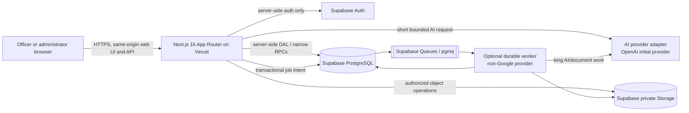

# Guided Operations Target Architecture

- **Status:** Target design with partial implementation; live qualification is
  incomplete
- **Last updated:** 2026-08-26
- **Scope:** Private, web-only, single-facility application

**Use classification:** Private single-facility application. Real operational
and personal data are permitted in isolated Production only after release gates
pass; local, CI, Preview, staging, and fixtures remain fictional.

## Read this first

The repository now implements protected officer/account/report/policy and
administrator routes, individual Auth-alias sign-in and account lifecycle,
current-session authorization, narrow private RPCs, append-only incident/report
and Count Sheet persistence, provider-neutral policy/report AI adapters,
immutable corpus-ingestion provenance, strict runtime readiness and redacted
core telemetry. Local fictional database-plus-Storage recovery is automated.

The shared Development Supabase project remains empty and behind the repository
migration head. No hosted user, real record, or corpus object exists. Protected
Vercel Previews build the Git branch, but the current candidate has not passed
signed-in browser qualification. Complete forms/exports, real-corpus import and
evaluation, hosted backup/restore, monitoring/alerts/budgets, retention/deletion
execution, live infrastructure, and promotion remain target work. Everything
labelled **target** is a constraint, not a claim that current code proves the
behavior in Production.

The replacement is intentionally a new system, but it preserves the useful
domain rules and contract tests from the former prison-policy-ai project. It
must not preserve the old Google Cloud hosting, Firebase hosting, shared access
codes, or browser-to-database trust assumptions.

## Target in one view



The browser talks only to the same-origin Next.js application. It does not query
application tables, Storage, queues, or AI providers directly. Next.js is the
backend-for-frontend and policy-enforcement point. PostgreSQL constraints,
privileges, and Row-Level Security provide defense in depth.

## Non-negotiable constraints

- Hosting is Vercel plus Supabase in aligned United States regions.
- Google Cloud, Firebase Hosting, Cloud Run, Cloud SQL, Google Cloud Storage,
  Cloud Tasks, Vertex AI, Agent Builder, Discovery Engine, and Google Secret
  Manager are not part of the target architecture.
- The GitHub repository is private and the product is web-only.
- The deployment serves one facility. Multi-facility tenancy is not being built
  speculatively.
- The Production target may hold owner-authorized real data after the exact
  release candidate is approved. This does not itself establish legal or agency
  compliance.
- No real incident, resident, report, roster, or paperwork data may be used in
  development, Preview, staging, demos, fixtures, screenshots, or AI evaluation.
  Production data follows `docs/operations/real-data-governance.md`.
- Login remains employee number plus a PIN-like secret. No shared access code is
  allowed. The exact Supabase Auth implementation is still an explicit security
  decision and spike; see ADR-0003.
- AI integration is provider-neutral. OpenAI is the initial approved provider,
  selected through a server-only adapter.
- Start on free tiers where they meet the environment's needs, but never treat a
  free tier as an availability, backup, security, or capacity promise.
- A separate durable worker may be introduced only when measured document or AI
  jobs exceed the qualified Vercel path. It must not use Google hosting.

## Architectural principles

1. **Server-side authority.** Authentication, authorization, data access,
   storage access, AI calls, queue publication, and exports live behind
   server-only modules.
2. **Reviewed facts, immutable history.** An edit appends a revision. Restore
   creates a new revision. AI output never silently overwrites human work.
3. **Least privilege twice.** The application checks authorization in the DAL,
   and PostgreSQL grants/RLS independently constrain reachable rows and
   operations.
4. **Fail closed.** Missing identity, stale revisions, incomplete citations,
   provider errors, expired jobs, and unknown document fields produce explicit
   errors or gaps, not permissive defaults or invented content.
5. **No sensitive logs.** Logs and audit events contain request IDs, stable
   identifiers, action codes, counts, timings, and digests—not credentials,
   policy text, prompts, generated answers, incident narratives, names, or
   employee numbers.
6. **Provider boundaries are interfaces.** Domain code does not import a hosted
   AI, queue, storage, or deployment SDK directly.
7. **One source of truth.** PostgreSQL owns record state and revision history;
   Storage owns object bytes; queue messages point to database work rather than
   carrying sensitive payloads.
8. **Test contracts before migration.** Preserve versioned API, security,
   concurrency, history, deterministic export, and no-fabrication tests.

## Target containers

| Container                    | Responsibilities                                                                                                                      | Must not do                                                                                                 |
| ---------------------------- | ------------------------------------------------------------------------------------------------------------------------------------- | ----------------------------------------------------------------------------------------------------------- |
| Next.js App Router on Vercel | Server Components, interactive React clients, Route Handlers, session refresh, validation, DAL, authorization, short AI orchestration | Expose database credentials, trust client claims, run unbounded jobs, or persist secrets in browser storage |
| Supabase Auth                | Credential verification, refresh/access sessions, Auth user identity                                                                  | Decide application RBAC alone or accept public self-signup                                                  |
| Supabase PostgreSQL          | Application records, immutable revisions, audit events, idempotency, RLS, retrieval metadata, job/outbox state                        | Store document/export bytes or expose private tables directly                                               |
| Supabase Storage             | Private source corpus, derived ingest artifacts, templates, generated exports                                                         | Host public policy objects or act as the only backup                                                        |
| Supabase Queues              | Durable work notification and visibility windows                                                                                      | Carry raw operational content or replace authoritative job state                                            |
| Optional durable worker      | OCR, ingestion, embedding batches, deterministic DOCX/PDF/ZIP, long AI work                                                           | Serve interactive user traffic, bypass authorization broadly, or use Google hosting                         |
| AI provider adapter          | Embeddings and bounded generation with model/version provenance                                                                       | Receive credentials or content from the browser                                                             |

Detailed container boundaries are in
[docs/architecture/containers.md](docs/architecture/containers.md).

## Repository direction

The target code should converge on these boundaries:

```text
src/
  app/                  # routes, pages, layouts, Route Handlers
  components/           # reusable UI; client boundaries kept narrow
  features/             # feature-level UI and orchestration
  server/
    auth/               # server-only Auth/session adapter
    dal/                # server-only data access and authorization
    domain/             # provider-neutral business rules
    ai/                 # provider interfaces and OpenAI adapter
    storage/            # private object adapter
    jobs/               # outbox/queue application services
  shared/               # safe schemas/types with no secrets
supabase/
  migrations/           # forward-only PostgreSQL migrations
  seed.sql               # fictional local/test data only
  tests/                # grants, RLS, constraints, functions
workers/                 # created only if ADR-0005 exit criteria are met
```

Server modules import the server-only marker. Client Components must remain at
the interactive leaves and receive the minimum serializable data needed to
render.

## Data and API posture

- Managed Auth data remains in Supabase's auth schema.
- Product tables live in the non-exposed `app_private` schema.
- The Supabase Data API exposes only the locked `api` schema. Add later reviewed
  functions/views explicitly; never expose application tables wholesale.
- User request paths carry the request's verified Auth identity into database
  authorization. Administrative secret/service credentials are not used for
  routine user traffic.
- Mutations require schema validation, CSRF protection, idempotency where
  retryable, and optimistic concurrency for revisioned records.
- The public browser contract is /api/web/v1. The old Microsoft Access bearer
  surface is not part of this web-only replacement.
- Dynamic authenticated responses are private and no-store unless a route has a
  documented, tested cache policy.

See [data-model.md](docs/architecture/data-model.md),
[api-contracts.md](docs/architecture/api-contracts.md), and
[auth-rbac-rls.md](docs/architecture/auth-rbac-rls.md).

## Reliability and cost posture

Free plans are suitable for local evaluation and an early non-operational
preview only after their current quotas are checked. Before each environment is
created, record:

- region availability and alignment;
- project pausing behavior;
- database, Storage, egress, Auth, vector, and queue limits;
- connection-pooler availability;
- backup and point-in-time recovery availability;
- Vercel function duration, memory, payload, build, log, and protection limits;
- whether the use is permitted by the current plan terms;
- the cost and trigger for the first paid upgrade.

Production readiness requires a written backup/restore plan and measured job
qualification. A zero-dollar plan is not an accepted substitute for either.

## Decision record

| ADR                                                   | Status   | Decision                                                                        |
| ----------------------------------------------------- | -------- | ------------------------------------------------------------------------------- |
| [ADR-0001](docs/adr/0001-nextjs-app-router.md)        | Accepted | Next.js 16 App Router and React 19 on Vercel                                    |
| [ADR-0002](docs/adr/0002-supabase-platform.md)        | Accepted | Supabase for PostgreSQL, Auth, Storage, Queues, and pgvector                    |
| [ADR-0003](docs/adr/0003-employee-number-pin-auth.md) | Proposed | Employee number plus PIN-like Supabase Auth bridge; spike and approval required |
| [ADR-0004](docs/adr/0004-provider-neutral-ai-rag.md)  | Accepted | Provider-neutral AI/RAG with OpenAI as the initial adapter                      |
| [ADR-0005](docs/adr/0005-long-running-worker.md)      | Proposed | Add one non-Google durable worker only if qualification requires it             |
| [ADR-0006](docs/adr/0006-single-facility-tenancy.md)  | Accepted | Model one facility without speculative tenant infrastructure                    |

## Documentation map

- [System context](docs/architecture/system-context.md)
- [Containers and trust boundaries](docs/architecture/containers.md)
- [Data flows](docs/architecture/data-flows.md)
- [Environment and delivery design](docs/architecture/environments.md)
- [Data model and migration rules](docs/architecture/data-model.md)
- [API contracts](docs/architecture/api-contracts.md)
- [Authentication, RBAC, and RLS](docs/architecture/auth-rbac-rls.md)
- [AI and retrieval](docs/architecture/ai-rag.md)
- [Storage and background jobs](docs/architecture/storage-jobs.md)
- [Legacy migration and reconciliation](docs/architecture/legacy-migration.md)
- [Security policy](SECURITY.md)

## Official references

- Next.js App Router data security:
  https://nextjs.org/docs/app/guides/data-security
- Next.js backend-for-frontend:
  https://nextjs.org/docs/app/guides/backend-for-frontend
- Supabase Auth: https://supabase.com/docs/guides/auth
- Supabase Row-Level Security:
  https://supabase.com/docs/guides/database/postgres/row-level-security
- Supabase database connections:
  https://supabase.com/docs/guides/database/connecting-to-postgres
- Supabase hybrid search: https://supabase.com/docs/guides/ai/hybrid-search
- Supabase Queues: https://supabase.com/docs/guides/queues
- Supabase Storage buckets:
  https://supabase.com/docs/guides/storage/buckets/fundamentals
- Vercel function limits: https://vercel.com/docs/functions/limitations
