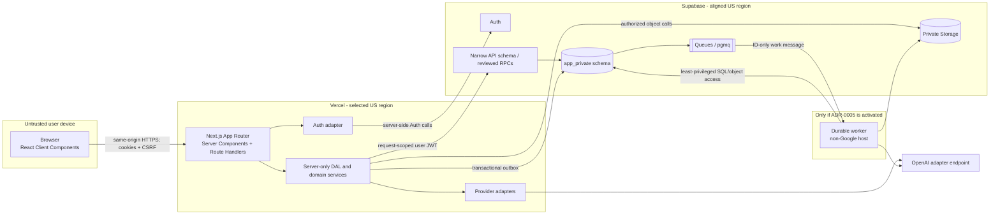

# Containers and Trust Boundaries

**Status:** Target design

## Container diagram

## 1. Browser

The browser renders server output and hosts narrowly scoped Client Components
for forms, editors, navigation state, and progressive job status.

Allowed:

- call same-origin Next.js pages and /api/web/v1 routes;
- hold a readable CSRF token where the double-submit design requires it;
- render already-authorized, minimum-necessary response data.

Prohibited:

- direct application-table, Storage, queue, or AI access;
- Supabase service/secret keys or database credentials;
- authorization decisions based on hidden controls;
- access or refresh tokens in localStorage;
- persistence of report/policy content in analytics or error tooling.

## 2. Next.js application on Vercel

Next.js is the backend-for-frontend. Server Components load authorized read
models. Route Handlers accept the stable HTTP contract. Client Components are
interactive leaves rather than an application-wide client boundary.

The Node.js runtime is the default for authenticated routes because it supports
the database/Auth libraries and server-only domain code. Edge runtime adoption
requires a route-specific ADR amendment and security/performance proof.

Responsibilities:

- validate untrusted inputs with shared schemas;
- refresh/verify Supabase Auth sessions server-side;
- load current account status and role;
- enforce ownership/RBAC in the DAL;
- forward the request-scoped user identity to narrow database functions;
- set CSRF, security, cache, and content-disposition headers;
- publish job intent transactionally;
- execute only short, bounded AI/provider work;
- return stable error envelopes and request IDs.

Every DAL entry point is server-only, returns a purpose-built DTO, and performs
authorization close to the query. Route Handlers must not return raw database
rows.

## 3. Supabase Auth

Supabase Auth owns password hashing and access/refresh sessions. Product
accounts reference Auth user IDs but keep application role, employee-number
mapping, status, forced-change state, and authorization version in the
non-exposed `app_private` schema.

Next.js is the only consumer of the raw access/refresh values. It stores the
Supabase session through a server-only custom adapter in an authenticated
encrypted HttpOnly cookie envelope. Browser JavaScript has neither a Supabase
Auth client nor access to the cookie contents. The dedicated envelope key is a
Vercel environment secret and its rotation signs every browser out.

Public signup and generic email/phone recovery are disabled. The employee-number
adapter is detailed in [auth-rbac-rls.md](auth-rbac-rls.md) and remains proposed
until qualified.

Auth establishes who the request claims to be. Current application tables
establish whether that identity is active and what it may do.

## 4. Supabase PostgreSQL

PostgreSQL is the system of record for structured state and history.

- Product tables live in `app_private`, which is not exposed by the Data API.
- The locked `api` schema may later expose reviewed functions/views to the
  server using the request's Auth JWT.
- Pre-auth employee lookup uses a separate server-only login role/function with
  execute-only privilege. It returns only the internal Auth alias needed for the
  attempted login and is never callable from the browser.
- anon has no product table privileges.
- authenticated receives only explicit execute/select grants required by the
  narrow API.
- Routine user traffic does not use a service role or BYPASSRLS role.
- RLS is forced on user-owned/sensitive tables and is tested independently of
  DAL tests.
- Security-definer functions are rare, schema-qualified, caller-checking, and
  granted individually.
- Serverless traffic uses the current supported transaction pooler with driver
  prepared statements disabled where required. Migrations and backup tools use
  the provider-recommended direct/session path.

Long external calls do not occur inside database transactions. Revisions,
idempotency records, audit metadata, and outbox intent commit atomically.

## 5. Supabase Storage

Storage holds bytes that do not belong in PostgreSQL:

- original policy/reference sources;
- quarantined and derived ingest artifacts;
- approved form/report templates;
- generated exports with lifecycle metadata.

All buckets are private. Database rows own object IDs, checksums, media types,
versions, sizes, classifications, and lifecycle state. Object access is issued
only after the same authorization used for its parent record.

## 6. Supabase Queues

Queues notify consumers of durable work. PostgreSQL job/outbox rows remain the
authoritative state.

Messages contain a schema version, job ID, job type, expected revision/version,
attempt metadata, and correlation ID. They do not contain source text, prompts,
answers, credentials, or generated files.

Consumers use visibility windows, idempotent claims, bounded retries, and
dead-letter handling. Queue delivery semantics do not justify non-idempotent
side effects.

## 7. Optional durable worker

The worker does not exist by default. It is introduced only after the
qualification in ADR-0005 shows that OCR, embedding batches, deterministic
document export, or another job cannot safely fit Vercel.

If activated, it:

- runs in a United States region on a non-Google provider;
- has no public user endpoints;
- polls/pulls only approved queues;
- uses a dedicated least-privileged database identity;
- downloads only the objects needed for its current job;
- writes results by immutable object key and atomic database completion;
- emits content-free operational telemetry.

The provider, patching model, network exposure, secret delivery, logging, backup
responsibility, and cost require a separate deployment decision.

## 8. AI provider adapter

Domain code depends on embedding and answer-generation interfaces. The first
adapter uses OpenAI. Model names, dimensions, timeouts, retry policy, and data
handling configuration are environment settings with validated defaults.

The adapter returns structured results and normalized provider errors. It never
decides authorization, record state, or citation validity.

## Communication and credential matrix

| Caller                         | Callee                  | Identity                                                                             | Content allowed                                                 |
| ------------------------------ | ----------------------- | ------------------------------------------------------------------------------------ | --------------------------------------------------------------- |
| Browser                        | Next.js                 | Secure session cookie + CSRF for mutations                                           | Authorized DTOs and user input                                  |
| Next.js pre-auth login adapter | PostgreSQL login lookup | Dedicated execute-only server credential                                             | Keyed employee lookup digest; internal alias response           |
| Next.js                        | Supabase Auth           | Server-side publishable/Auth context; admin API only in protected provisioning paths | Login/session fields                                            |
| Next.js                        | PostgreSQL API          | Request-scoped Auth JWT                                                              | Validated application fields                                    |
| Next.js                        | Storage                 | Request-scoped identity or narrow server operation                                   | Authorized objects only                                         |
| Next.js                        | OpenAI                  | Server-only provider key                                                             | Bounded fictional workflow content or authorized policy context |
| Worker                         | Queue/DB/Storage        | Dedicated worker credentials                                                         | Job IDs and job-scoped objects                                  |
| CI/operator                    | Supabase/Vercel         | Protected environment credentials                                                    | Migrations/configuration, never production content              |

## Failure isolation

- Auth unavailable: existing server-verified requests fail closed; login/refresh
  reports an unavailable state without bypass.
- Database unavailable: no mutation is acknowledged; idempotency allows safe
  retry.
- Storage unavailable: structured record remains intact; export/source action
  reports unavailable.
- Queue unavailable: transaction retains undispatched outbox intent for retry.
- AI unavailable: manual workflow remains usable and existing reviewed data is
  not modified.
- Worker unavailable: claimed work is recovered after its visibility/lease
  timeout; duplicate completion is rejected.
