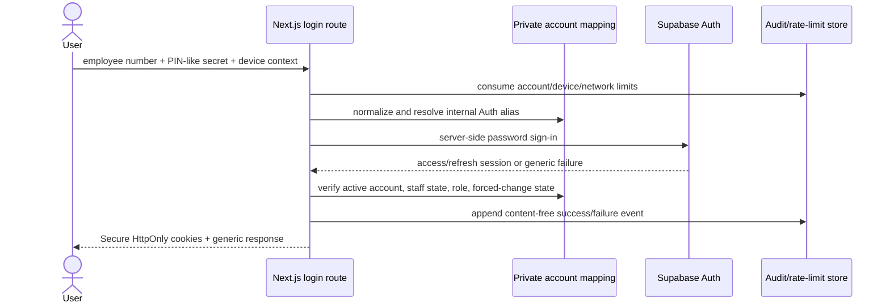
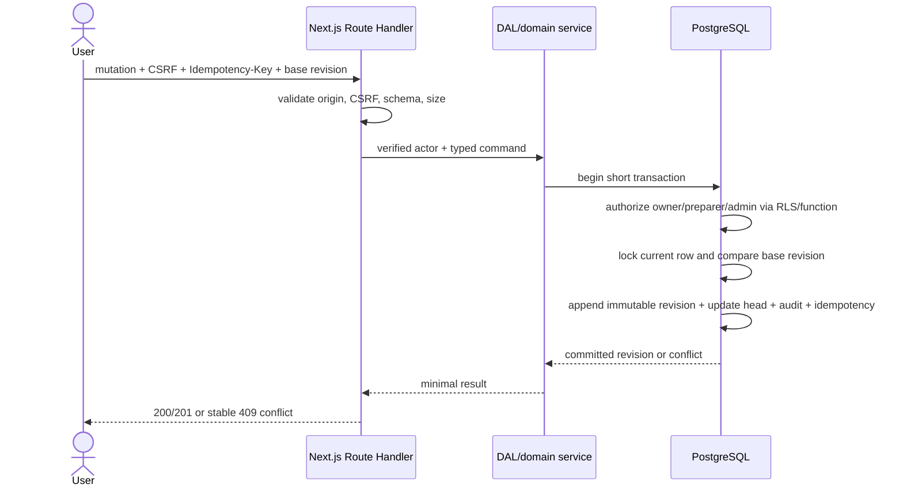
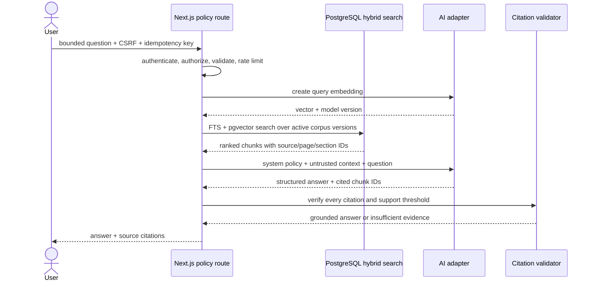

# Data Flows

**Status:** Target design

Every flow begins with untrusted input and ends with either an explicit,
authorized result or a stable failure. Content-free request IDs connect browser,
server, database, queue, worker, and provider telemetry.

## 1. Employee login and session establishment

Rules:

- Resolution and Auth failure use a comparable path and one generic message.
- The internal Auth alias is never returned to the browser or logged.
- Public signup and user-supplied email/phone identifiers are unavailable.
- The browser receives no service credential and stores no token in
  localStorage.
- Login is not production-ready until ADR-0003 acceptance tests pass.

## 2. Authenticated page read

1. Next.js refreshes/verifies the cookie session using the supported SSR Auth
   flow.
2. The DAL loads the current application account by Auth user ID and rejects
   inactive, locked, or forced-change states where appropriate.
3. The DAL calls a purpose-specific query/RPC using the request identity.
4. PostgreSQL grants and RLS independently constrain rows.
5. The DAL maps rows to a minimal DTO.
6. The Server Component renders the non-interactive shell; only editor controls
   become Client Components.
7. Authenticated responses are private/no-store unless a reviewed route
   explicitly documents a safe cache.

## 3. Create or revise an incident/report

Restore follows the same flow but copies a selected prior snapshot into a new
head revision. It never updates or deletes historical content.

## 4. AI-assisted report work

1. User explicitly submits a reviewed incident revision for a named job type.
2. The server validates ownership, job type, base revision, idempotency key, and
   AI eligibility.
3. One transaction inserts the durable job, safe audit metadata, and outbox
   intent.
4. A dispatcher places only the job ID and expected revision/version on the
   queue.
5. The bounded Vercel executor or optional worker atomically claims the job.
6. It loads the authorized immutable source revision.
7. Provider-neutral extraction returns structured slots.
8. Deterministic validation identifies gaps and contradictions.
9. Generation receives reviewed structured facts, not an uncontrolled raw-note
   prompt.
10. Completion rechecks the current base. A stale result is rejected or stored
    only as explicitly non-current recovery output.
11. User reviews before any generated content becomes a current record.

Provider calls occur outside record-locking transactions.

## 5. Policy question

The system stores safe operational metrics and a question digest, not the raw
question/answer, unless a later retention decision explicitly changes that.
Retrieved source text is data and cannot issue instructions to the application.

## 6. Corpus ingestion

1. An administrator/operator creates a document/version record with source
   provenance, classification, expected checksum, and ingest idempotency key.
2. A short-lived authorized upload places the object in a private quarantine
   prefix.
3. The service verifies size, media type, checksum, duplicate status, and
   allowed parser before promoting the object metadata to queued.
4. A durable job extracts text/OCR outside the web request, preserving page
   boundaries and extraction version.
5. Text is normalized and split into deterministic chunks with immutable source
   references.
6. The selected embedding adapter creates vectors in bounded batches.
7. A transaction inserts document pages/chunks/embedding metadata and marks the
   version ready only after count/checksum validation.
8. A retrieval evaluation must pass before the version becomes active.
9. Superseding a source creates a new version; old citations remain resolvable.

Corpus bytes and text never enter GitHub Actions artifacts or general logs.

## 7. Document export

1. User selects an explicit immutable revision and export format.
2. Server authenticates, authorizes, validates idempotency, and creates an
   export job tied to that exact revision/template version.
3. A short qualified path may render immediately. Otherwise the queue/worker
   produces deterministic bytes.
4. The result is uploaded once to a content-addressed private object key.
5. PostgreSQL records checksum, size, media type, template version, creator, and
   expiry/lifecycle state.
6. Download reauthorizes the current user. Restricted output is streamed through
   the app or receives a very short-lived signed URL.
7. Audit records IDs, format, revision, and result—not document text.

## 8. Administrative change

Account creation, role/status change, PIN reset, session revocation, record
transfer/restore, bulk export, corpus activation, and audit export require:

1. authenticated active administrator;
2. current role loaded from the database;
3. recent admin elevation where configured;
4. purpose-bound, single-use step-up;
5. CSRF and idempotency validation;
6. a short transaction that preserves the last active administrator rule;
7. session/auth-version invalidation when authority changes;
8. content-minimized append-only audit metadata.

Non-admin callers receive a concealed not-found response on admin-only resources
where route discovery itself is sensitive.

## Cross-flow error contract

- 400 validation failure with field-safe details;
- 401 authentication required or reauthentication required;
- 403 permitted only when revealing the resource/action is safe;
- 404 for absent or deliberately concealed unauthorized resources;
- 409 stale revision or idempotency conflict;
- 413 bounded payload exceeded;
- 422 well-formed but domain-invalid command;
- 429 rate limited with retry guidance;
- 503 dependency unavailable without internal/provider detail.

Errors include a request ID and stable code. They never echo credentials,
provider payloads, SQL, corpus passages, or restricted record fields.
