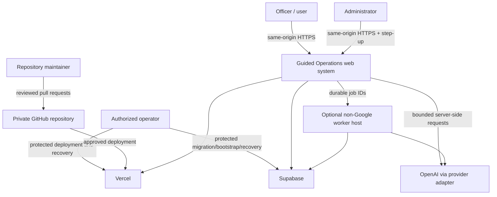

# System Context

- **Status:** Target design
- **Deployment shape:** One private web application for one facility

## Problem being solved

Guided Operations helps facility staff turn reviewed information into consistent
reports and paperwork and ask grounded questions of an approved policy corpus.
The application must preserve human review, immutable history, citation
provenance, and practical employee-number login without reintroducing the old
shared-code or Google-hosted architecture.

## Actors

| Actor                 | Goals                                                                                                                                     | Authority                                                                |
| --------------------- | ----------------------------------------------------------------------------------------------------------------------------------------- | ------------------------------------------------------------------------ |
| Officer/user          | Sign in, work on owned incidents and reports, populate approved forms, use operational utilities, ask policy questions, export owned work | Own/preparer records only; no account administration                     |
| Administrator         | Manage staff accounts, review records, transfer ownership, restore revisions, audit activity, manage corpus and templates                 | Facility-wide application authority with step-up for high-impact actions |
| Repository maintainer | Review code, migrations, dependencies, and deployment changes                                                                             | Source control; no implied access to production content                  |
| Authorized operator   | Configure Vercel/Supabase, bootstrap first admin, run migrations, restore backups                                                         | Time-bound operational authority; actions audited                        |
| Background worker     | Execute a claimed document, ingest, embedding, or AI job                                                                                  | Narrow machine identity and job-scoped data access                       |

There is no public customer, anonymous user, external Microsoft Access client,
or second facility in the target scope.

## External systems

| System                    | Use                                                    | Boundary                                                                                         |
| ------------------------- | ------------------------------------------------------ | ------------------------------------------------------------------------------------------------ |
| GitHub private repository | Source, review, CI, protected deployment inputs        | Never stores runtime credentials, real operational data, or corpus objects                       |
| Vercel                    | Next.js builds, preview/staging/production web runtime | US function region aligned to Supabase; plan limits validated per environment                    |
| Supabase                  | Auth, PostgreSQL, private Storage, Queues, pgvector    | Separate environment projects; non-exposed `app_private` schema and least privilege              |
| OpenAI                    | Initial embedding and answer-generation provider       | Server/worker only through an adapter; content and retention settings reviewed before corpus use |
| Optional worker host      | Long-running OCR/document/AI work when required        | Must be non-Google, US-hosted, privately configured, and separately approved                     |

Google Cloud and Firebase are outside the approved target and must not appear in
the runtime or deployment dependency graph.

## Context diagram

## Data boundary

The product schema can represent incidents, reports, forms, staff accounts, and
paperwork so feature behavior can be built and tested. Until a later explicit
approval, all such content is fictional.

The real policy/reference corpus is restricted source material. It may be stored
only in approved private Storage and retrieval tables, and only after source
ownership, version, checksum, and access classification have been recorded.
Corpus text must not enter Git, CI logs, test snapshots, public previews, or
error telemetry.

## Functional requirements

- Employee-number plus PIN-like sign-in, forced first credential change, session
  management, logout-all, and administrative account lifecycle.
- Home/status workspace and owned incident/report library.
- Six-stage reviewed report workflow with immutable revisions, gaps, validation,
  conflict handling, restore, and deterministic exports.
- Form/packet workflow, physical paperwork guidance, and revisioned operational
  utilities.
- Administrator account, audit, record review, restore, transfer, and health
  workflows.
- Policy Expert with hybrid retrieval, source/version/page citations, and
  insufficient-evidence behavior.
- Versioned same-origin web API, idempotent mutations, job status, and
  observable failure states.

## Non-functional requirements

- Default-deny authorization and RLS with no browser database credentials.
- Accessible keyboard and screen-reader operation and WCAG AA target.
- No loss or rewriting of committed revisions.
- Deterministic retry behavior and stale-result rejection.
- No operational content in logs or queue messages.
- Bounded provider calls and graceful degraded state when AI is unavailable.
- Environment isolation, recoverable migrations, backup/restore evidence, and
  cost alerts before production.
- Responsive desktop/tablet browser experience; no native/mobile client
  contract.

## Assumptions to validate

- A suitable Supabase PostgreSQL region and a Vercel function region can be
  aligned in the United States.
- The selected plan supports the required Auth settings, connection mode,
  Storage, pgvector, queues, backup objective, and deployment protection.
- The employee-number alias design can safely use Supabase Auth without exposing
  a synthetic identifier or enabling email recovery.
- The policy corpus size, document formats, and embedding volume fit the chosen
  tier or have a funded upgrade path.
- Short requests fit Vercel limits; measured outliers trigger ADR-0005 rather
  than wishful timeouts.

## Explicit non-goals

- Multi-facility tenancy, facility switching, and cross-facility sharing.
- Public signup, consumer accounts, marketing content management, or public API.
- Autonomous disciplinary or policy decisions.
- Replacing official records systems or representing AI output as policy/legal
  authority.
- Google-hosted fallback infrastructure.
