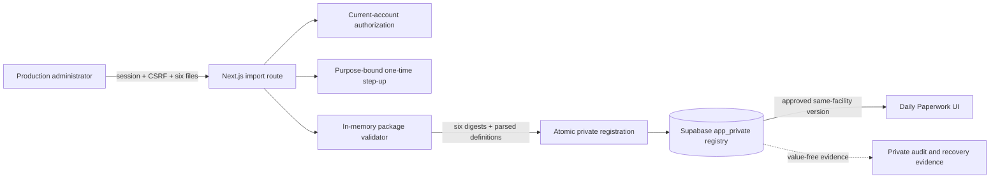

# Daily Paperwork Production import threat model

## Overview

This model covers the planned administrator workflow that will acquire,
validate, approve, register, activate, and roll back the six Daily Paperwork
definitions. The source files contain facility-specific operational structure
and therefore must enter the application only inside the isolated Production
boundary. Their bodies must never be copied into Git, local development, CI,
Preview, staging, screenshots, telemetry, or support artifacts
(`docs/migration/source-manifest.md:150`).

The current code implements the protected server-side foundation but does
**not** yet expose an administrator page or authorize a real import:

- a server-only, in-memory package validator that requires all six files,
  validates bounded closed JSON structures, and calculates SHA-256 digests
  (`src/server/paperwork/daily-paperwork-source-package.ts:254`);
- an append-only, forced-RLS private template registry with exact source and
  approval metadata
  (`supabase/migrations/20260827130000_add_daily_paperwork_template_registry.sql:39`);
- a pinned mapper, digest-bound manifest, Production-only review and step-up
  routes, and an atomic private package-registration migration
  (`src/server/paperwork/daily-paperwork-template-mapper.ts:1`;
  `src/app/api/admin/daily-paperwork-template-package/route.ts:1`;
  `supabase/migrations/20260828151000_add_daily_paperwork_template_packages.sql:1`).

The intended workflow is:

1. A current same-facility administrator opens a Production-only import page.
2. The server reauthorizes the session and verifies the exact origin and the
   session-bound CSRF proof.
3. The administrator performs a fresh, purpose-bound passcode step-up.
4. The browser submits exactly six bounded JSON files. The server validates the
   complete package in memory and returns only kinds, sizes, digests, and
   validation results for review—not definition bodies.
5. Approval binds the administrator, facility, rights decision, source
   authority/revision, effective date, and exact six-file digest set.
6. A pinned mapper transforms the source contracts into the separate rendering
   contracts. The package manifest binds the mapper version and both the source
   and mapped-definition digests.
7. One database transaction appends one immutable package record plus six
   immutable registry rows or no rows. Activation occurs only after all six rows
   and their evidence are committed and read back by package digest.
8. Rollback never edits or deletes a prior row. It appends a new approved
   version copied from a previously approved version and records the reason and
   source relationship.

### Components and source evidence

| Component                     | Responsibility                                                                                                                                       | Evidence                                                                                                                                                                                |
| ----------------------------- | ---------------------------------------------------------------------------------------------------------------------------------------------------- | --------------------------------------------------------------------------------------------------------------------------------------------------------------------------------------- |
| Production admin browser      | Select exactly six source files, review value-free evidence, confirm rights/revision/effective date, and perform step-up                             | Planned surface; server routes exist but no page is connected                                                                                                                           |
| Next.js import endpoint       | Reauthorize, enforce Production, origin/CSRF, request size, exact file set, step-up, safe errors, and no-store responses                             | `src/app/api/admin/daily-paperwork-template-package/route.ts:1`; `src/app/api/admin/daily-paperwork-template-step-up/route.ts:1`                                                        |
| Package validator             | Fatal UTF-8/JSON parsing, filename-kind binding, strict schemas, byte bounds, unique kinds/codes, blank runtime identifiers, and SHA-256             | `src/server/paperwork/daily-paperwork-source-package.ts:12`; `src/server/paperwork/daily-paperwork-source-package.ts:258`; `src/server/paperwork/daily-paperwork-source-package.ts:299` |
| Pinned definition mapper      | Convert each source contract into the separate database `structure` and `field_schema` rendering contracts and bind that mapping version to approval | `src/server/paperwork/daily-paperwork-template-mapper.ts:1`; `src/server/paperwork/daily-paperwork-import-manifest.ts:1`                                                                |
| Step-up store                 | Issue a five-minute, purpose-bound keyed digest and consume it once                                                                                  | `src/server/auth/admin-step-up.ts:33`; `src/server/auth/private-admin-step-up-store.ts:66`                                                                                              |
| Private template registry     | Store facility/version/source/rights/approval/structure metadata as immutable rows with forced RLS                                                   | `supabase/migrations/20260827130000_add_daily_paperwork_template_registry.sql:39`; `supabase/migrations/20260827130000_add_daily_paperwork_template_registry.sql:110`                   |
| Daily Paperwork read workflow | Return only the current approved same-facility template to a current administrator                                                                   | `supabase/migrations/20260827130000_add_daily_paperwork_template_registry.sql:285`                                                                                                      |
| Production database backup    | Preserve registry rows and approval evidence; recovery must be rehearsed before activation                                                           | Required by `docs/architecture/environments.md:81`; hosted evidence is still open                                                                                                       |

### Effective resources and capabilities

| Deployment or workflow      | Resource or capability                                  | Configuration and precedence                                                                                              | Safe effective value or location                                                  | Readers, writers, or recipients                                   | Enforcing control                                                                                       | Evidence or unknowns                                                                                                                                                   |
| --------------------------- | ------------------------------------------------------- | ------------------------------------------------------------------------------------------------------------------------- | --------------------------------------------------------------------------------- | ----------------------------------------------------------------- | ------------------------------------------------------------------------------------------------------- | ---------------------------------------------------------------------------------------------------------------------------------------------------------------------- |
| Local, CI, Preview, staging | Form source bodies                                      | Environment classification overrides feature availability                                                                 | Absent; fictional package fixtures only                                           | Developers and automated tests receive fictional values           | Import endpoint returns 404/fail closed outside `APP_ENV=production`; tracked-secret/data scan          | `src/app/api/admin/daily-paperwork-template-package/route.ts:31`; hosted negative qualification remains open                                                           |
| Production validation       | Six uploaded JSON files                                 | Mandatory bounded request length, then server byte limits, then closed schemas                                            | Request memory only until approval/registration completes                         | Current administrator request and server validator                | Exact six-file set; 2–256,000 bytes each; fatal UTF-8 and JSON parsing; strict schemas; no body logging | `src/app/api/admin/daily-paperwork-template-package/route.ts:95`; `src/server/paperwork/daily-paperwork-source-package.ts:254`                                         |
| Production approval         | One-time administrator authority                        | Current session, exact origin, session CSRF, then purpose-specific step-up                                                | Keyed digest in private database; raw proof exists for one following request only | Same administrator session and private step-up routine            | Five-minute expiry, purpose and package-digest binding, single-use consume                              | `src/server/auth/admin-step-up.ts:10`; `src/app/api/admin/daily-paperwork-template-step-up/route.ts:1`                                                                 |
| Production registration     | One approved package and six approved template versions | Session-derived administrator/facility plus review-bound package digest, pinned mapping version, and database transaction | Private package row plus `app_private.form_templates`                             | Narrow server database routine and same-facility approved readers | Forced RLS, revoked Data API grants, facility lock, atomic insert, immutable trigger                    | `supabase/migrations/20260828151000_add_daily_paperwork_template_packages.sql:1`; local database replay remains open                                                   |
| Production display/save     | Current approved template                               | Work date and highest applicable approved version for the current facility                                                | Private JSON structure and field schema returned through narrow RPC               | Current same-facility administrator only                          | Current role/status/passcode checks and approved/effective-date filters                                 | `supabase/migrations/20260827130000_add_daily_paperwork_template_registry.sql:313`; `supabase/migrations/20260827130000_add_daily_paperwork_template_registry.sql:327` |
| Production rollback         | Prior approved definition                               | New version must reference and exactly match a prior immutable six-template package                                       | New append-only registry rows; no update/delete                                   | Purpose-stepped-up administrator and private registration routine | Exact six-row equality check, atomic append, provenance link, concurrency and idempotency keys          | `supabase/migrations/20260828151000_add_daily_paperwork_template_packages.sql:274`; database execution remains open                                                    |
| Backup and recovery         | Registry rows and any retained original bytes           | Production backup policy and isolated recovery rehearsal                                                                  | Encrypted database backup; private Storage only if originals are retained         | Protected operators and isolated recovery project                 | Manifest/digest verification, least privilege, restore qualification                                    | Whether exact original JSON bytes must be retained in private Storage is an owner/records-custodian decision                                                           |

## Threat model, trust boundaries, and assumptions

### Protected assets and objectives

- The private operational field structure, controlled values, source order, and
  print configuration of all six definitions.
- The integrity of the exact approved source authority, revision, SHA-256,
  facility, rights decision, approver, effective date, and version.
- The guarantee that the six-template catalog moves as one package so a partial
  import cannot mix incompatible versions.
- Same-facility administrator authority and the one-time step-up proof.
- Append-only revision history, audit evidence, and recoverable Production
  backups.
- The non-production boundary: no real source body may reach Git, local, CI,
  Preview, staging, logs, screenshots, error responses, or test artifacts.

### Actors and starting capabilities

- A normal authenticated officer has no Daily Paperwork import or template-read
  authority.
- An authenticated administrator can use approved Daily Paperwork for their own
  facility. This does not automatically grant source import/approval authority;
  a fresh purpose-bound step-up is required.
- A cross-site origin can cause browser requests but lacks the exact origin and
  session-bound CSRF proof.
- A caller can submit arbitrary filenames and bytes to the planned upload
  endpoint, but cannot choose the authoritative facility or approver identity.
- A compromised Production server or direct database credential is a broader
  privileged compromise and is not assumed as an ordinary browser attacker.

### Trust boundaries and invariants

1. **Environment to route:** the route must derive Production from validated
   server configuration and fail closed before reading a file body anywhere
   else. A browser label, hostname substring, or Vercel environment name alone
   is not authority.
2. **Browser to server:** current-session authorization, exact origin, CSRF, and
   request bounds occur before parsing or mutation. Error responses and logs
   contain only an allowlisted request ID and generic reason class.
3. **Step-up to approval:** the proof is bound to one template-package purpose,
   one session/account, one request, and a short lifetime. Validation alone does
   not consume approval authority; registration consumes it exactly once.
4. **Untrusted bytes to parsed definition:** every file must pass fatal UTF-8,
   JSON, strict schema, kind/filename, controlled-value, uniqueness, and size
   checks. Parsed text is data and is never rendered as HTML or executed.
5. **Review to mapping and commit:** the review screen, pinned mapper, and
   registration transaction must use the same exact digest set. Any changed
   source byte, mapping version, or mapped-definition byte invalidates approval.
6. **Server to database:** facility and approver come from the current
   authoritative account, not request fields. A single private transaction
   validates expected next versions and appends all six rows plus bounded audit
   evidence.
7. **Registry to product:** only approved, effective, same-facility immutable
   versions are readable. A quarantined, partial, superseded, or future version
   cannot control a form.
8. **Rollback and recovery:** rollback appends a new reviewed version; it never
   mutates history. Backups must restore the registry, approval evidence, and
   any separately retained original bytes together.

### Assumptions, exclusions, and open questions

- The pinned legacy blobs establish provenance but do not themselves authorize
  the current operational revision or rights. The records owner still must
  approve those facts (`docs/migration/source-manifest.md:166`).
- The six pinned blobs contain no completed staff identity, employee number,
  historical entry, or populated equipment identifier, but their operational
  structure is still restricted (`docs/migration/source-manifest.md:150`).
- Production-only review, package-bound step-up, atomic registration, and exact
  append-only rollback code now exist, but no administrator UI, hosted
  migration, real import, or activation approval exists.
- The pinned mapper keeps the kind-specific source schemas separate from the
  renderer's `structure` and `field_schema` contracts, and the package digest
  binds the mapper version and both source and mapped digests.
- Template import and rollback now use separate purpose-bound step-up proofs.
- The exact deployed Production Supabase project, runtime database principal,
  Vercel variables, backup job, and restore evidence are not established by
  source code and must be verified at release time.
- Decide whether exact original JSON bytes need long-term private-Storage
  retention or whether the immutable parsed registry plus source digest and
  separately retained legacy source is the records-authorized source of truth.
- Malware scanning for small strict JSON has limited value beyond byte/type and
  schema validation, but the Production upload policy requires an explicit
  decision and test evidence before launch.

## Attack surface, mitigations, and attacker stories

The following are threat hypotheses for design and testing. They are not
confirmed vulnerabilities.

| Priority | Scenario and capability gain                                                           | Prerequisites                                                                               | Impact                                                                          | Existing controls                                                                             | Required mitigation                                                                                                                                         | Evidence                                                                                                                      |
| -------- | -------------------------------------------------------------------------------------- | ------------------------------------------------------------------------------------------- | ------------------------------------------------------------------------------- | --------------------------------------------------------------------------------------------- | ----------------------------------------------------------------------------------------------------------------------------------------------------------- | ----------------------------------------------------------------------------------------------------------------------------- |
| High     | Environment confusion sends real definitions to Preview, CI, or a Development database | Import route trusts hostname/UI state or mismatched environment credentials                 | Restricted operational structure leaves Production and may enter logs/artifacts | Server route fails closed unless `APP_ENV=production`                                         | Bind Vercel/Supabase project identities and complete hosted negative qualification                                                                          | `SECURITY.md:62`; `src/app/api/admin/daily-paperwork-template-package/route.ts:31`                                            |
| High     | An administrator imports into another facility or an officer reaches the route         | Caller-controlled facility/approver or weak role checks                                     | Cross-facility configuration change and unauthorized disclosure                 | Current readers derive facility from active administrator state                               | Derive facility/actor only from current account; private insert routine; direct browser and service-role denial tests                                       | `supabase/migrations/20260827130000_add_daily_paperwork_template_registry.sql:313`                                            |
| High     | Approval is replayed or used for different bytes or a different mapping                | Generic/reusable step-up or review not bound to digests and mapping version                 | Unreviewed definitions become active under a valid approval                     | Step-up tokens are purpose-bound, short-lived, and single-use                                 | Add import-specific purpose; bind exact ordered source/mapped digests, mapping version, and metadata; consume inside registration transaction               | `src/server/auth/admin-step-up.ts:33`; `src/server/auth/authorize-admin-action.ts:19`                                         |
| High     | Partial or concurrent import mixes versions                                            | Per-file writes, retry after timeout, or two administrators import simultaneously           | Daily Paperwork catalog becomes inconsistent or unavailable                     | Unique facility/code/version and immutable rows                                               | One six-row transaction; advisory/row lock per facility; expected-version check; idempotency key and readback                                               | `supabase/migrations/20260827130000_add_daily_paperwork_template_registry.sql:76`                                             |
| High     | Malicious JSON exploits rendering or stores executable markup                          | Attacker can submit source package                                                          | Stored script, misleading form controls, or unsafe downstream parsing           | Closed schemas, bounded strings, HTML/control/email/ADC-number rejection, fatal JSON parsing  | Preserve text rendering; add CSP/browser tests; never use raw HTML; reject unexpected MIME/extension                                                        | `src/server/paperwork/daily-paperwork-source-package.ts:14`; `src/server/paperwork/daily-paperwork-source-package.ts:299`     |
| Medium   | Source bodies leak through exceptions, logs, telemetry, or review response             | Validation error or operational instrumentation serializes request/parser objects           | Confidential operational structure disclosure                                   | Value-free package summary exists; repository logging policy is redacted                      | Central safe error mapping; never log filenames supplied by user unless normalized/allowlisted; response only fixed filename/kind/bytes/hash; log tests     | `src/server/paperwork/daily-paperwork-source-package.ts:284`; `SECURITY.md:193`                                               |
| Medium   | Oversized or highly nested JSON exhausts server memory/CPU                             | Authenticated administrator sends adversarial files                                         | Request denial or elevated hosting cost                                         | Mandatory request length, aggregate/per-file limits, and bounded schemas                      | Verify the effective host limit and add runtime rate/timeout evidence before activation                                                                     | `src/app/api/admin/daily-paperwork-template-package/route.ts:95`; `src/server/paperwork/daily-paperwork-source-package.ts:12` |
| Medium   | A quarantined or retired version shadows the last approved version                     | Higher version exists but selection orders before status filtering                          | Form unexpectedly disappears, creating availability/rollback failure            | Selection fails closed instead of exposing an unapproved definition                           | Keep quarantine evidence outside the active row set; registration should add only complete approved packages; add fail-closed and recovery regression tests | Current ordering precedes rights check at `supabase/migrations/20260827133000_add_daily_paperwork_workflow.sql:578`           |
| Medium   | Rollback mutates, deletes, or substitutes historical evidence                          | Operator uses direct SQL or submits definitions that differ from the claimed source package | Audit/provenance loss                                                           | Immutable triggers, revoked grants, exact referenced-package comparison, append-only versions | Execute the pgTAP rollback-negative and recovery tests before activation                                                                                    | `supabase/migrations/20260828151000_add_daily_paperwork_template_packages.sql:274`                                            |
| Medium   | Database succeeds but response fails, leading to a duplicate retry                     | Network/function timeout after commit                                                       | Duplicate versions or confusing activation state                                | Facility-scoped idempotency key and exact retry readback                                      | Execute transaction and retry tests against the local and isolated Production database                                                                      | `supabase/migrations/20260828151000_add_daily_paperwork_template_packages.sql:246`                                            |
| Low      | Cross-site request attempts an import using ambient cookies                            | Administrator is signed in and visits attacker content                                      | Unauthorized action if browser-origin controls fail                             | Existing sensitive mutations require current session, origin, and CSRF                        | Apply the same order before reading files; SameSite cookies; negative route tests                                                                           | `SECURITY.md:130`                                                                                                             |
| Low      | Filename/path tricks attempt server filesystem access                                  | Endpoint writes upload filenames to disk                                                    | Arbitrary file overwrite/read                                                   | Validator accepts only fixed normalized JSON filenames and can operate in memory              | Never write browser filenames to disk; compare to exact allowlist; no temp artifacts                                                                        | `src/server/paperwork/daily-paperwork-source-package.ts:302`                                                                  |

One current query behavior deserves a regression test before registration is
enabled: the catalog chooses the highest version before the `rights_status`
eligibility check. A newer quarantined or retired row could therefore shadow an
older approved row and make the form unavailable. This is fail-closed and is a
design hypothesis, not a confirmed exploitable vulnerability, because the
implemented registration routine accepts only complete approved packages
(`supabase/migrations/20260827133000_add_daily_paperwork_workflow.sql:578`).

## Severity calibration

### Critical

Use Critical when an ordinary remote or authenticated attacker can obtain broad
real operational/personal data, execute code in the trusted runtime, control the
Production database, or bypass facility isolation at scale without another
privileged compromise. A hypothetical leak that first requires complete Vercel
or database-owner compromise is not independently Critical.

### High

Use High for a reachable path that lets an officer or same-facility
administrator approve unreviewed bytes, change another facility's templates,
move restricted bodies outside Production, or make stored active content execute
in another user's browser. Effective current-session, exact-origin, step-up,
digest binding, and private-database controls can reduce or reject these
stories.

### Medium

Use Medium for bounded but meaningful leakage through logs, denial of one
facility's forms, package/version integrity loss, unbounded authenticated upload
cost, or rollback/audit weakness. A shadowing inactive version is Medium when it
causes availability loss but no disclosure or privilege gain.

### Low

Use Low for defense-in-depth gaps with limited reach, generic error differences,
or nuisance denial that remains tightly authenticated and bounded. Missing
runtime evidence is an open release question, not automatically a Low finding.

Repository:
codex-security-target/v1:sha256:83f433274139b1dbd602410c8673ca3785e44721509de86269af4cac99271de1
Version: 0fb87a8f458f3e9b41538cd845155569f3eb8995
